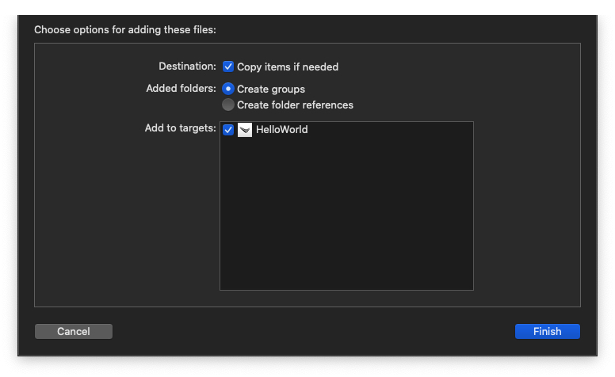
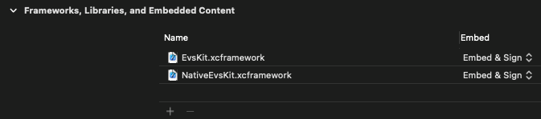
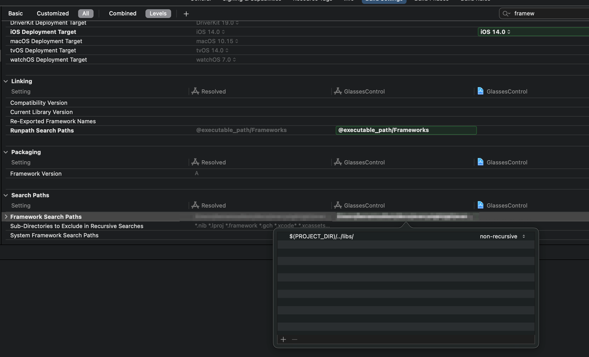
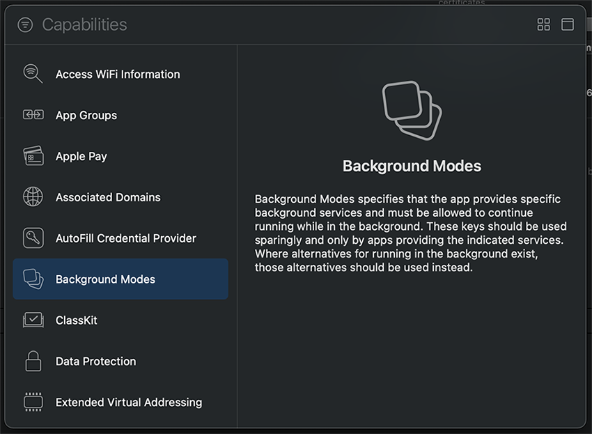
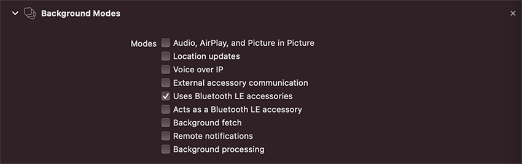
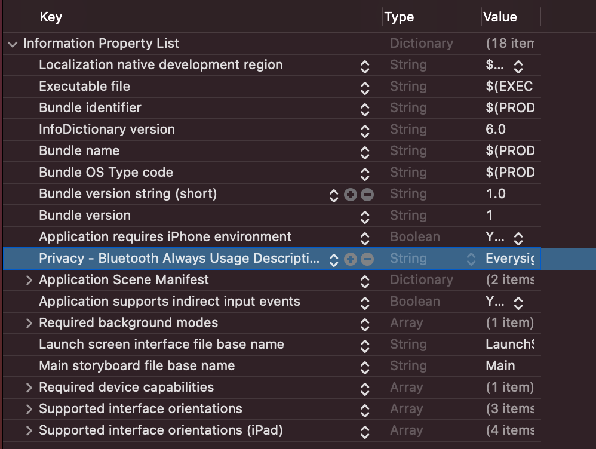
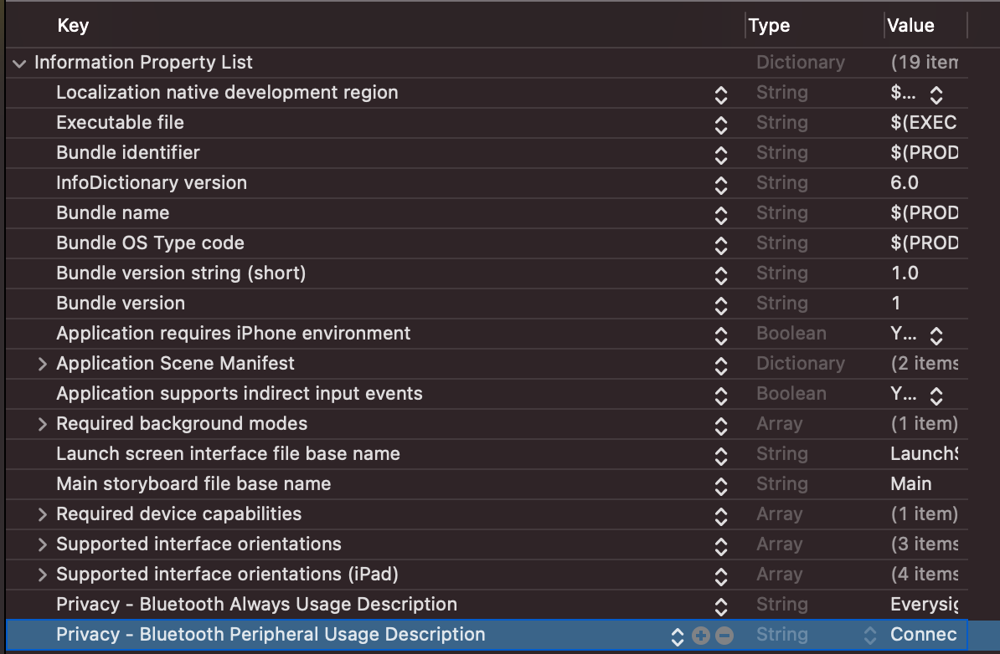

# IOS Samples

## Overview

This folder contains the IOS samples for the Maverick SDK.

It is recommended to explore, download and run the samples.

## The Samples

It is recommended to learn the samples by the following order:

Sample | Description
-------|------------
[HelloWorld](./HelloWorld) | Your first 'hello world' application
[GlassesControl](./GlassesControl) | How to control you glasses
[UIElements](./UIElements) | Adding various ui elements on your screen
[CustomControls](./CustomControls) | Creating custom ui elements
[ImagesHandling](./ImagesHandling) | Using images
[Animations](./Animations) | Performing animations
[OtaHandling](./OtaHandling) | Glasses firmware updates

## Using the samples

All the samples are built and run using Xcode.

- Clone\Download this repository to your pc
- Copy the SDK IOS frameworks files you got (`EvsKit.framework` and  `NativeEvsKit.framework`) to samples-> IOS-> lib

**For each sample**:
- Create a folder named `Resources` and add the api key certificate file by dragging and dropping the file on to the xcode `Resources` folder.
- Drop the file your will see a dialog like this one, do not forget to tick the `Add to targets`
  

- Reference **both of the SDK frameworks** you got from Everysight to the [libs](./libs) folder

- Add the libs folder to the project framework search path

- Add permissions to the project to use BLE in background under the project singing and capabilities add the **Background Modes** capability
  

- Once added, check the **"Uses Bluetooth LE accessories"** option
  

- Add to the project plist.info the following:
    - **key**: Privacy - Bluetooth Always Usage Description `NSBluetoothAlwaysUsageDescription`
    - **value(string)**: "*Your app name or company*" would like to use bluetooth.
  

- Configure as follows:
    - **key**: Privacy - Bluetooth Peripheral Usage Description `NSBluetoothPeripheralUsageDescription`
    - **value(string)**:"*Everysight would like to use bluetooth.*" or any other suitable description

        
### Note

Before launching a sample **make sure the previous one is closed** (only one application can be connected to the glasses simultaneously)

