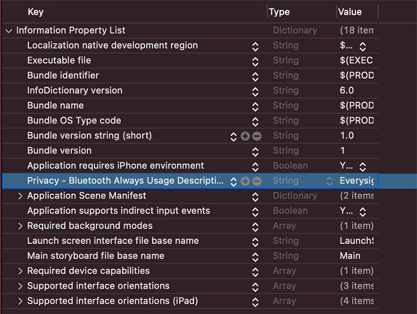
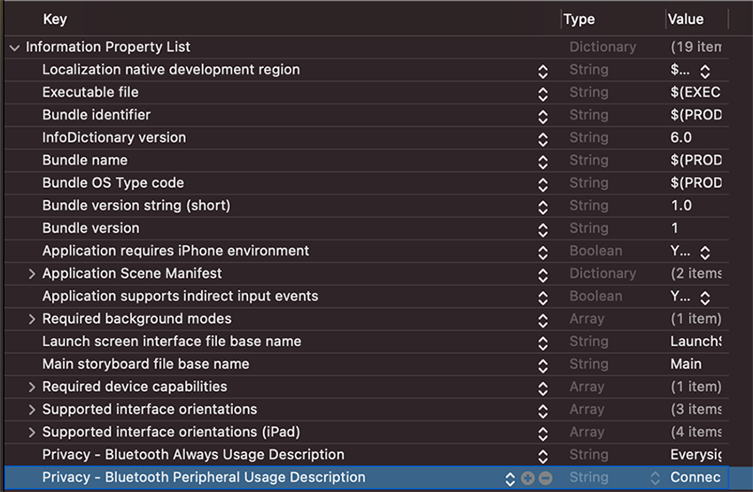

# IOS Samples

## Overview

This folder contains the IOS samples for the Epsilon Software Developer Kit

It is recommended to learn, download and run the samples


## SDK frameworks

The SDK contains the following frameworks

### - NativeEvsKit.xcframework

The SDK Core, contains all the class and logic required for developing your application

Common for IOS and Android, implemented in Kotlin Native

The Native API documentation can be found [here](../README.md#api-documentation)

### - EvsKit.xcframework

Contains the SDK (thin) bootstrap for IOS, as described [here](#sdk-bootstrap)

The bootstrap initializes the Native library with IOS specific functionalities like resources management and bluetooth communication

## SDK Bootstrap

The SDK bootstrap class is a singleton class named `Evs`

The `Evs.instance()` returns the `IEvsApp` which is the entry point for all of the SDK functionalities


### Initializing `Evs`

Before any call to any SDK functionality you must call  the `start` functions
```kotlin
//init the SDK with an IOS context (internally) and start its operation
//start can be called on any part of the IOS application life time according to your application flow
Evs.instance().start()
```

### Setting a Logger

You may set a logger to the SDK to receive log information

You may use the default SDK logger, which writes to the debug output or you may wrote a logger of your own

Start the default logger
```kotlin
//enables logging
Evs.startDefaultLogger()
```
Advanced logging capabilities will be described separately

### Using the app instance

```kotlin
//get the IEvsApp instance
Evs.instance()
```
Please refer to the samples and the api documentation for more information

### Stopping `Evs`

Upon application termination, you should stop the SDK functionality
```kotlin
//stopping the SDK functionality
Evs.instance().stop()
```
## The Samples

For beginners, it is recommended to learn the samples by the following order

Sample | Description
-------|------------
[HelloWorld](./HelloWorld) | Your first 'hello world' application
[GlassesControl](./GlassesControl) | How to control you glasses
[UIElements](./UIElements) | Adding various ui elements on your screen
[CustomControls](./CustomControls) | Creating custom ui elements
[ImagesHandling](./ImagesHandling) | Using images
[Animations](./Animations) | Performing animations
[OtaHandling](./OtaHandling) | Glasses firmware updates

## Using the samples

All the samples are built and run using Xcode

- Clone\Download this repository to your pc
- Copy the SDK IOS frameworks files you got (`EvsKit.framework` and  `NativeEvsKit.framework`) to samples-> IOS-> lib
    - **Note that simulator builds are note supported at this time.**
- Create a folder named `Resources`  and add the certificate file by dragging and dropping the file on to the xcode `Resources` folder.
    - Repeat this step **for each sample**
    - Once you drop the file your will see a dialog like this one, do not forget to tick the `Add to targets`

- Reference **both of the SDK frameworks** you got from Everysight to the [libs](./libs) folder


- Add the libs folder to the project framework search path


- Add permissions to the project to use BLE in background
    - Under the project singing and capabilities add the **Background Modes** capability

background_mode.png
    - Once added, check the **"Uses Bluetotoh LE accessories"** option


    - Add to the project plist.info the following:
        - key: Privacy - Bluetooth Always Usage Description `NSBluetoothAlwaysUsageDescription`
        - value(string): "Your app name or company" would like to use bluetooth.

        - key: Privacy - Bluetooth Peripheral Usage Description `NSBluetoothPeripheralUsageDescription`
        - value(string):"Everysight would like to use bluetooth." or any other suitable description
        
        
## Notes

- Only one application from the same phone should be connected to the glasses simultaneously, otherwise the glasses display behavior is undefined. Before launching a sample **make sure the previous one is closed**
- Animations won't work properly on old phones with low Bluetooth bandwidth. Bluetooth 5 is recommanded for good animation performance
- Animations will not run during assets uploading to glasses (like images)
