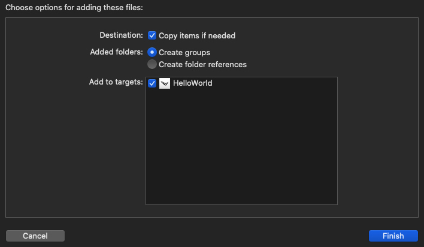

# iOS Samples

## Overview

This folder contains the iOS samples for the Maverick SDK.

It is recommended to explore, download and run the samples.

## The Samples

It is recommended to learn the samples by the following order:

Sample | Description
-------|------------
[HelloWorld](./HelloWorld) | Your first 'hello world' application
[GlassesControl](./GlassesControl) | How to control you glasses
[UIElements](./UIElements) | Adding various ui elements on your screen
[CustomControls](./CustomControls) | Creating custom ui elements
[ImagesHandling](./ImagesHandling) | Using images
[Animations](./Animations) | Performing animations
[OtaHandling](./OtaHandling) | Glasses firmware updates
[SwiftUI](./SwiftUIGlassesControl) | SwiftUI App example
[AR](./Ar) | LOS (Line fo sight) example

## Using the samples

All the samples are built and run using Xcode.

- Clone\Download this repository to your pc
- Import the SDK libraries via SPM (Swift Package Manager) - more information can be found [here](https://everysight.github.io/maverick_docs/libraries-api/ios/)

### **For each sample**:

1. Create a folder named `Resources` and add your `sdk.key` file by dragging and dropping the file on to the xcode `Resources` folder.
2. Drop the file your will see a dialog like this one, do not forget to tick the `Add to targets`
  

3. Add permissions to the project to use BLE in background
    - Under the project singing and capabilities
    - Add the **Background Modes** capability
  

4. Once added, check the **"Uses Bluetooth LE accessories"** option
  

5. Add to the project plist.info the following:
    - **key**: Privacy - Bluetooth Always Usage Description `NSBluetoothAlwaysUsageDescription`
    - **value(string)**: "*Your app name or company*" would like to use bluetooth.
  

6. Configure as follows:
    - **key**: Privacy - Bluetooth Peripheral Usage Description `NSBluetoothPeripheralUsageDescription`
    - **value(string)**:"*Everysight would like to use bluetooth.*" or any other suitable description

## More information

More information about iOS application setup can be found in our [developers portal](https://everysight.github.io/maverick_docs/libraries-api/overview/)

### Note

Before launching a sample **make sure the previous one is closed** (only one application can be connected to the glasses simultaneously)

